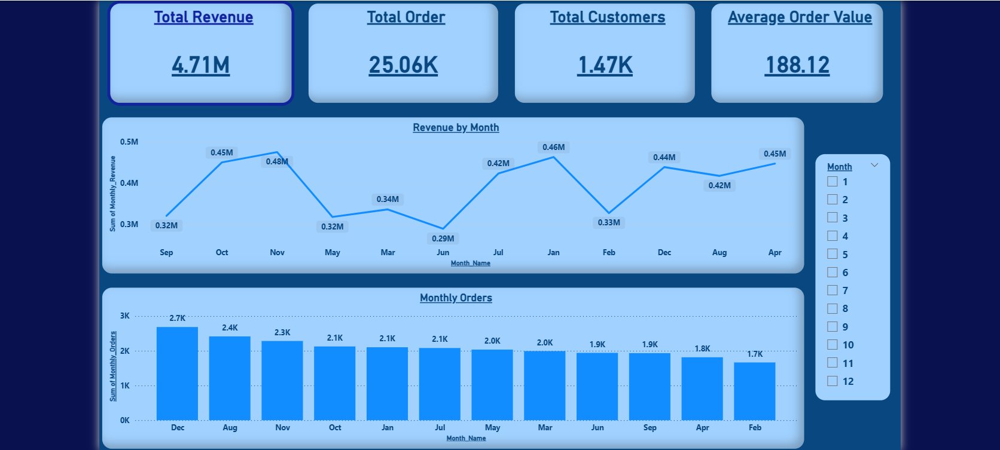
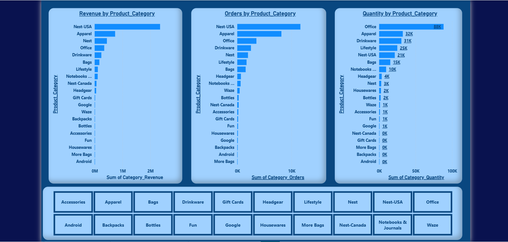
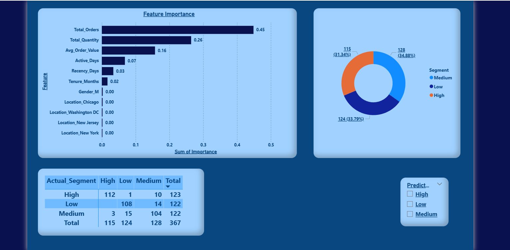
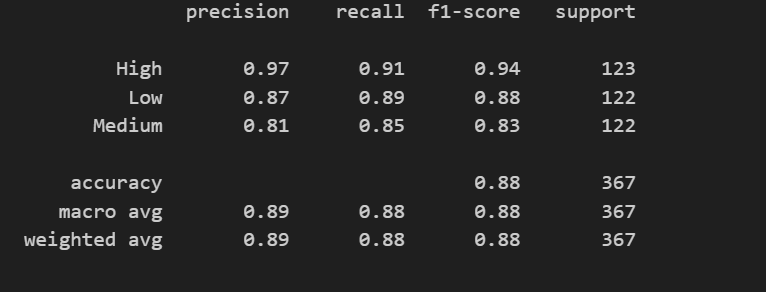

Marketing Insights & Customer Value Prediction

An end-to-end data analytics and machine learning project that analyzes e-commerce sales data to generate business insights and predict customer value segments.

This project demonstrates the complete analytics lifecycle:
Data Cleaning → KPI Analysis → Feature Engineering → Machine Learning → Power BI Dashboard

Project Objective

The goal of this project is to:
Analyze e-commerce sales performance
Identify key revenue drivers
Segment customers into value groups (High, Medium, Low)
Build a predictive ML model for customer value
Create an interactive Power BI dashboard for business decision-making

Tech Stack

Python (Pandas, NumPy)
Scikit-learn
SQL
Jupyter Notebook
Power BI

Business Analysis
Key KPIs (Business Overview Page)

Category-Level Analysis

Identified top-performing categories (Nest-USA, Apparel, Office, etc.)

Predict customer value segment:

Models Tested

Logistic Regression
Decision Tree
Random Forest

Final Model: Random Forest
Selected based on highest accuracy and better class balance.

Model Performance

Key Insight: Customer purchase frequency is the most important factor in determining customer value.

Outcome

This project demonstrates:

✔ Strong data cleaning & preprocessing
✔ KPI-based business analysis
✔ Customer-level feature engineering
✔ Model comparison & evaluation
✔ Explainable ML using feature importance
✔ Business dashboard integration
